# Autoencoder Pipeline for Morphology Analysis
<p align="justify">
This repository provides a complete workflow for <strong>image preprocessing</strong>, <strong>deep feature extraction</strong>, and <strong>unsupervised clustering</strong> for insect morphology studies by using the wings images. The pipeline standardizes raw images, learns compact latent “fingerprints” using a convolutional autoencoder, and then groups similar specimens through clustering methods such as OPTICS, KMeans, and Agglomerative clustering.
</p>
This framework was developed in collaboration with Muséum national d'Histoire naturelle (MNHN) teams, University of Oxford and INSERM. It's designed for <strong>reproducibility</strong>, <strong>scalability</strong>, and <strong>biological interpretability</strong>.


<p align="center">
  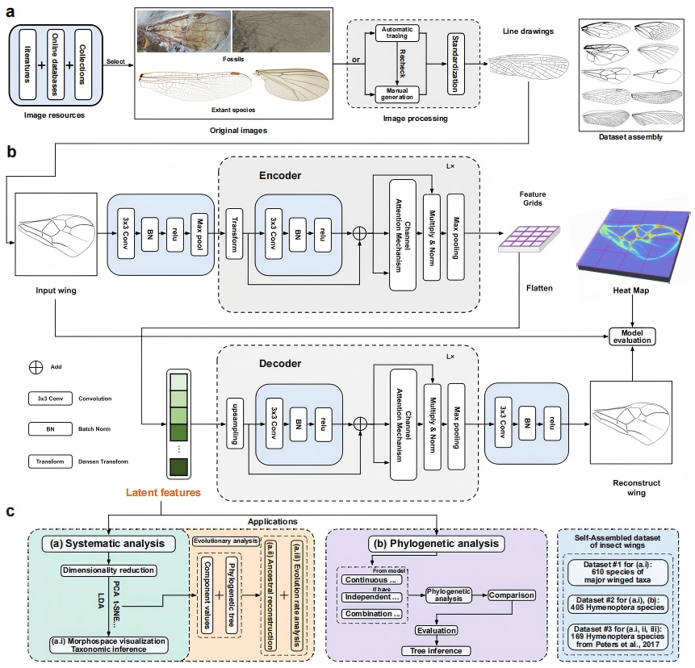
</p>

---

## ✨ Features

- **Unified two-step pipeline**
  - **Preprocessing**: format unification, resizing, renaming.
  - **Autoencoder representation learning**: compact latent embeddings.
  - **Clustering**: OPTICS, KMeans, Agglomerative, with metrics and visualizations.

- **Rich visual outputs**
  - Activation maps  
  - Attention / importance heatmaps  
  - t-SNE / PCA projections  
  - Clustering diagnostics

- **Reproducible model + feature outputs**
  - Embedding files  
  - Model checkpoints  
  - Excel summary reports  

---

## 📦 Requirements

Python **3.9+**

Install all dependencies:

```bash
pip install -r requirements.txt
```

---

## 📁 Repository Structure

```
├── preprocess.py           # Preprocessing raw images
├── main.py                 # Autoencoder + clustering pipeline
├── user_guide.docx         # Full detailed documentation
├── README.md               # Project introduction
└── (Output folders created after running the scripts)
```

---

# Part 1 — Preprocessing (`preprocessing.py`)

<p align="center">
  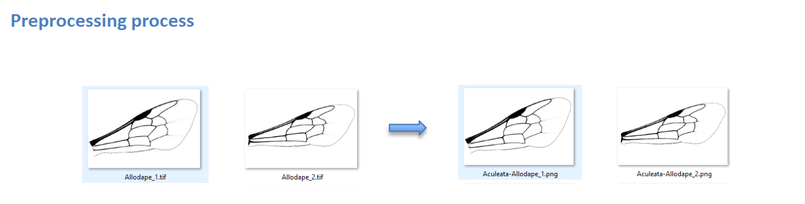
</p>


### 🔧 What it does
- Scans all subfolders for images  
- Resizes & converts images to PNG  
- Standardizes naming scheme  
- Produces dataset statistics & label summaries  

### 🔑 Key Settings

| Setting | Meaning | Suggested |
|--------|---------|-----------|
| `input_dir` | Raw image folder | Your dataset path |
| `output_dir` | Output folder | e.g., `D:\preprocessing` |
| `IMAGE_SIZE` | Final image size | Match training resolution |
| `SUPPORTED_FORMATS` | Allowed types | png, jpg, jpeg, bmp, tif |

### ▶️ Run

```bash
python preprocess.py
```

### 📤 Outputs
- Resized PNGs  
- `statistics.csv`  
- `family_counts.csv`, `species_counts.csv`  
- `unique_families.txt`, `unique_species.txt`, `unique_names.txt`  
- `errors.log`  

---

# Part 2 — Autoencoder + Clustering (`main.py`)

### 🎯 Goal
Train an autoencoder to extract morphological features, then cluster them to reveal structure in the dataset.


### 🧠 Model Structure
A convolutional autoencoder compresses each image into a low-dimensional latent vector.  
These embeddings are clustered and visualized using multiple methods.

<p align="center">
  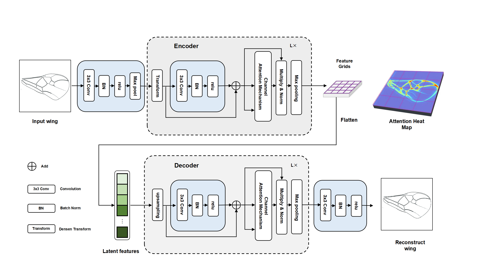
</p>

### 🔑 Hyperparameters

| Param | Location | Description | Recommendation |
|-------|----------|-------------|----------------|
| `data_folder` | in `main()` | Input processed images | Use preprocess output |
| `OUTPUT_DIR` | top of file | Save path | New folder per run |
| `IMG_SIZE` | top of file | Training size | 128–224 |
| `LATENT_DIM` | top of file | Embedding length | 32–128 |
| `BATCH_SIZE` | top of file | Step size | 8–32 |
| `EPOCHS` | top of file | Training epochs | 40–100 |
| `REG_FACTOR` | top of file | Weight decay | 1e-5 → 5e-5 |

### ▶️ Run

```bash
python main.py
```

---

# 📂 Output Directory Overview

All results are saved under your chosen `OUTPUT_DIR`.

### 🔍 Main Files & Their Use

| File/Folder | Description | Use |
|-------------|-------------|-----|
| `autoencoder.h5` | Full model | Reconstruction / further training |
| `encoder.h5` | Encoder-only | Extract embeddings for new images |
| `image_embeddings.txt` | Latent vectors | Clustering & ML |
| `activations/` | Filter activations | Interpret model focus |
| `heatmaps/` | Attention overlays | Morphological relevance |
| `tsne_plots/` | 2D visualizations | Inspect global structure |
| `clustering_results.xlsx` | Cluster labels & coordinates | Main summary |
| `clustering_metrics.xlsx` | Silhouette, CH, DBI | Compare cluster quality |
| `clustering_metrics.png` | Bar chart | Quick inspection |

---

# 📘 How to Interpret Results

### `clustering_results.xlsx`
Contains:
- filename  
- family / species / name  
- cluster labels (OPTICS, KMeans, Agglomerative)  
- t-SNE / PCA 2D coordinates  

### `clustering_metrics.xlsx`
- `silhouette` → higher = better  
- `calinski_harabasz` → higher = better  
- `davies_bouldin` → lower = better  

---

# 🔧 Hyperparameter Tips

1. Start small: `128×128`, `LATENT_DIM=64`, `BATCH_SIZE=16`, `EPOCHS=40`.  
2. Blurry reconstructions → increase `LATENT_DIM` or `EPOCHS`.  
3. Noisy heatmaps → increase `REG_FACTOR`.  
4. Compare clustering metrics to choose the best run.  
5. Use a fresh `OUTPUT_DIR` per experiment.

---

# 👀 Visual Outputs

- **Activation maps** → internal filter responses
<p align="center">
  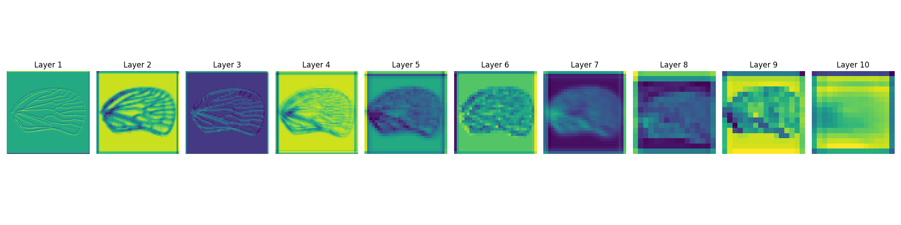
</p>
  
- **Heatmaps** → important morphological regions

<p align="center">
  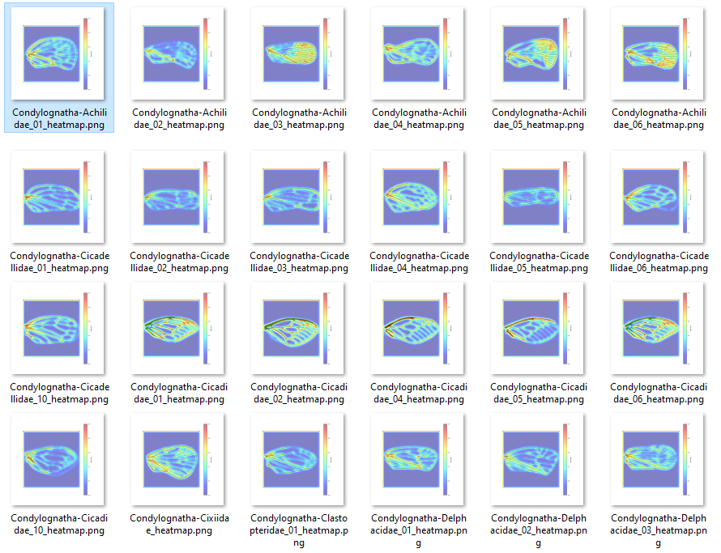
</p>

- **t-SNE & PCA** → visual grouping of specimens  


---

# ❗ Troubleshooting

- No images found → check `data_folder`  
- Out of memory → reduce `IMG_SIZE` or `BATCH_SIZE`  
- OPTICS returns many `-1` → try KMeans/Agglomerative  
- Windows path issues → use double `\\` (e.g., `D:\\data\\images`)  


#

---
<br><br><br><br>
---

# Wing Segmentation and Morphological Analysis

The segmentation folder contains two core scripts that perform **automatic insect wing segmentation** and **biomechanical property estimation**.

---

## `seg_main.py`

This script performs **wing segmentation using the Segment Anything Model (SAM)**.  
It automatically generates masks for each input image and extracts feature embeddings for further analysis.

**Main steps:**
1. Load and preprocess all insect wing images.  
2. Use the Meta AI **Segment Anything (ViT-B)** model to detect and segment individual wing regions.  
3. Save all mask files for each specimen in a dedicated subfolder (`*_masks/`).  
4. Compute embeddings for each segmented region using a pretrained **MobileNetV2** feature extractor.  
5. Visualize species clustering using **PCA** and **t-SNE** projections.

**Output examples:**
- Segmentation masks (per image)  
- Extracted feature CSV files  
- Clustering visualizations (`PCA`, `t-SNE`, `dendrograms`)  

📁 **Example output structure:**
```
SEG_all_new/
 ├── image1_masks/
 │   ├── image1_mask_0.png
 │   ├── image1_mask_1.png
 │   └── ...
 ├── extracted_features.csv
 └── cluster_labels_with_pca_tsne.csv
```
<p align="center">
  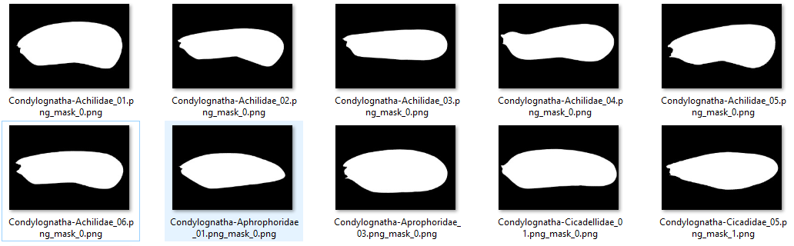
  <br>
  <em>Figure. Automatic segmentation.</em>
</p>
---

### `outline_extract_and_calculate.py`

This script post-processes the SAM-generated masks to **extract wing outlines** and **compute morphological flight metrics**.

**Main functions:**
1. Combine individual mask regions for each specimen.  
2. Extract the **largest contour** representing the full wing area.  
3. Compute key aerodynamic parameters:  
   - **Wing span (b)**  
   - **Wing area (S)**  
   - **Average chord (c = S/b)**  
   - **Aspect ratio (AR = b²/S)**  
4. Estimate **body volumes and flight efficiency** based on wing span scaling laws.  
5. Save all wing outline images and parameter reports (`TXT`, `Excel`).

**Output examples:**
- Outlined wing images (black on white background)  
- `wing_body_parameters.xlsx` — including span, area, aspect ratio, and flight efficiency  
- `wing_body_parameters.txt` — detailed per-image summaries  

📁 **Example output structure:**
```
Wing_Outlines_new/
 ├── image1_combined_outline.png
 ├── wing_body_parameters.xlsx
 └── wing_body_parameters.txt
```

---

### 🧭 Workflow Summary

1. Run `seg_main.py` → performs segmentation and feature extraction.  
2. Run `outline_extract_and_calculate.py` → extracts outlines and computes morphological/flight traits.  

📷 **Example illustration:**
<p align="center">
  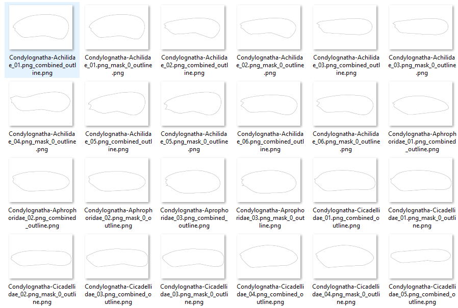
  <br>
  <em>Figure. Automatic segmentation and morphological parameter extraction.</em>
</p>


---
<br><br><br><br>

# 🧊 3D Extension (Volumetric Shapes and primates dataset)
<p align="justify">
The repository includes a minimal, self-contained <strong>3D generalization</strong> demo under <strong>`3d_expansion`</strong>.  
It shows that our representation-learning + clustering pipeline <strong>extends naturally to 3D morphology and primates 3d data </strong> by learning latent codes from <strong>synthetic volumetric shapes</strong> (e.g., sphere, cube, ellipsoid, cylinder, torus; and cuneiform, femur, mandible, patella, scapula, vertebra for primates).
</p>
<table align="center">
  <tr>
    <td align="center">
      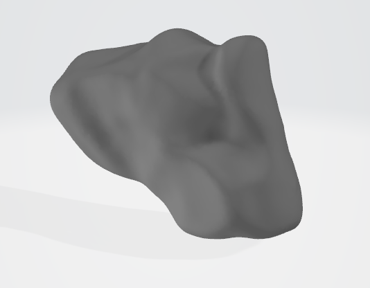<br>
      <b>Cuneiform</b>
    </td>
    <td align="center">
      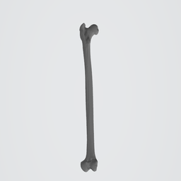<br>
      <b>Femur</b>
    </td>
    <td align="center">
      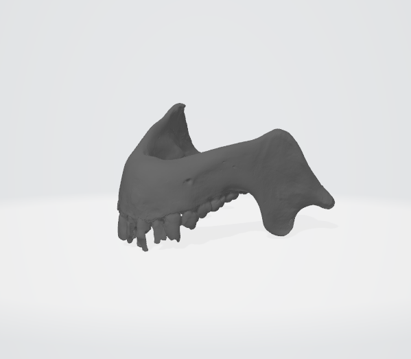<br>
      <b>Mandible</b>
    </td>
  </tr>
  <tr>
    <td align="center">
      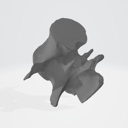<br>
      <b>Vertebra</b>
    </td>
    <td align="center">
      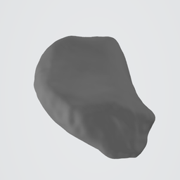<br>
      <b>Patella</b>
    </td>
    <td align="center">
      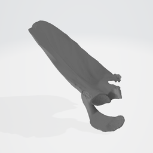<br>
      <b>Scapula</b>
    </td>
  </tr>
</table>
<p align="center">
  <em>3D primates datasets examples. The raw volume data were downloaded from MorphoSource (ID: 000656244; Almécija et al. 2024).</em>
</p>
---

### 📂 Folder
```
3d_extensioni/
 ├── main_3d.py          # 3D synthetic shapes + 3D autoencoder + projections (t-SNE/PCA)
 ├── primates/           # basic results for primates
 └── (generated outputs after running)
```

---

### ▶️ How to run
From the project root:
```bash
python main_3d.py
```

This will:
1) **Generate synthetic 3D shapes** (voxel grids)  
2) **Train a lightweight 3D autoencoder** to learn latent features  
3) **Project latent codes** with t-SNE/PCA for visualization  
4) **Save plots** under `outputs_3d_demo/`

Expected outputs:
```
outputs_3d_demo/
 ├── tsne_3d.png   # t-SNE on latent features (colored by shape)
 └── pca_3d.png    # PCA on latent features (colored by shape)
```

---

### 📝 What this demonstrates
- The same **autoencoder-based feature learning** strategy works on **3D volumes**.  
- Shape classes form **separable clusters** in the learned latent space (see t-SNE/PCA).  
- This provides a simple proof-of-concept that our 2D pipeline **generalizes to 3D morphology**.

---

### 📷 visualization results for volume data
<p align="center">
  
  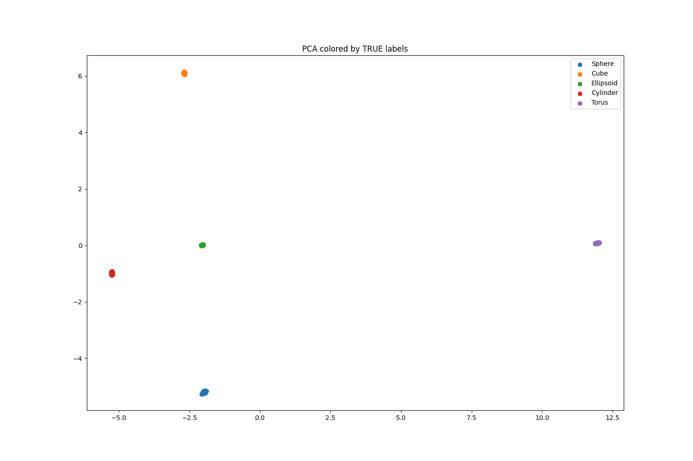
  <br>
  <em>3D latent projections: t-SNE (left) and PCA (right).</em>
</p>

### 📷 visualization results for primates data
<p align="center">
  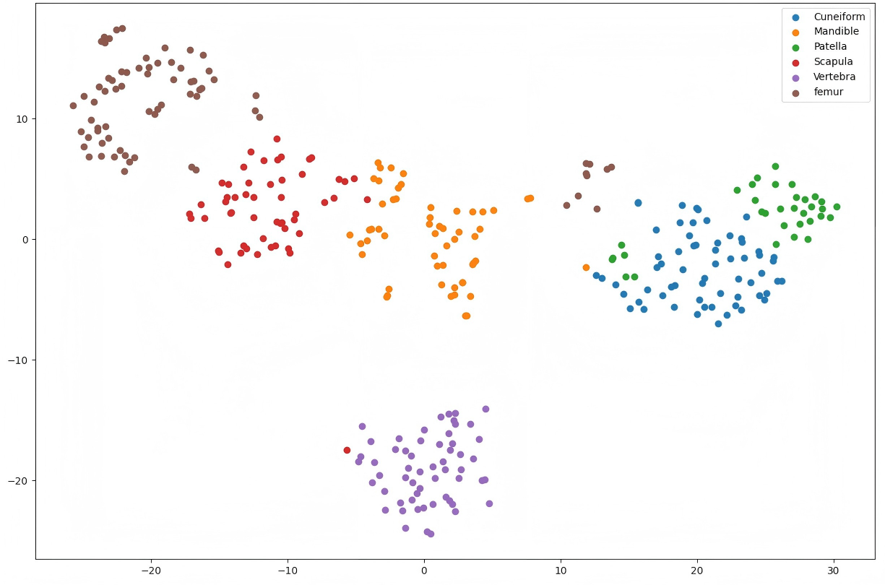
  
  <br>
  <em>3D latent projections: t-SNE (left) and PCA (right).</em>
</p>


---

# 📄 Citation

If you use this pipeline in research, please cite:

---
# 📄 References
Almécija, S., Pugh, K. D., Anaya, A., Smith, C. M., Simmons, N. B., Voss, R. S., ... & Catalano, S. A. (2024). Primate Phenotypes: A Multi-Institution Collection of 3D Morphological Data Housed in MorphoSource. Scientific Data, 11(1), 1391.

---

# 📜 License

MIT License  

---

# 🙋 Contact

For questions, suggestions, or collaborations, please feel free to open an issue or contact the author shihan.guan@univ-rennes.fr.
